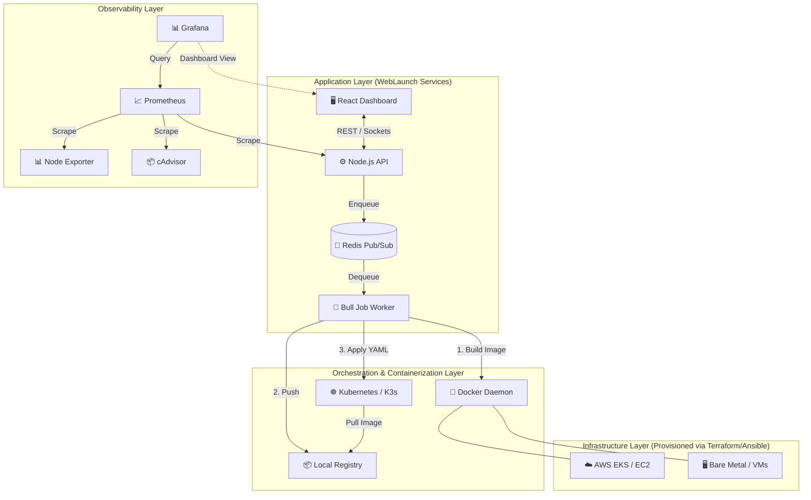
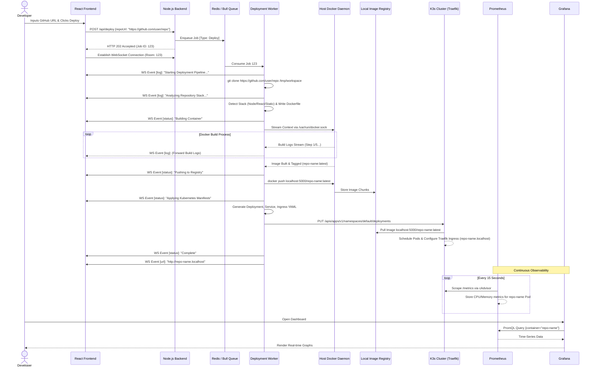

<div align="center">
  
  
  # 🚀 WebLaunch Platform
  
  **The Fully Automated, Zero-Config Website Deployment, Infrastructure, & Orchestration Platform**
  
  [](https://opensource.org/licenses/MIT)
  [](https://reactjs.org/)
  [](https://nodejs.org/)
  [](https://kubernetes.io/)
  [](https://www.docker.com/)
  [](https://grafana.com/)
  [](https://prometheus.io/)
  [](https://www.terraform.io/)
  [](https://www.ansible.com/)
</div>

---

## 📖 Table of Contents

1. [Executive Summary & Problem Statement](#1-executive-summary--problem-statement)
2. [Project Vision & Core Philosophies](#2-project-vision--core-philosophies)
3. [High-Level Architecture & Topologies](#3-high-level-architecture--topologies)
4. [Infrastructure as Code: The Terraform Layer](#4-infrastructure-as-code-the-terraform-layer)
5. [Configuration Management: The Ansible Layer](#5-configuration-management-the-ansible-layer)
6. [Deep Dive: The Software Stack](#6-deep-dive-the-software-stack)
    * [6.1 The Frontend Presentation Layer](#61-the-frontend-presentation-layer)
    * [6.2 The Backend Orchestration Engine](#62-the-backend-orchestration-engine)
    * [6.3 The Asynchronous Task Queue (Redis/Bull)](#63-the-asynchronous-task-queue-redisbull)
    * [6.4 Containerization & K3s Orchestration](#64-containerization--k3s-orchestration)
7. [The Observability & Telemetry Stack](#7-the-observability--telemetry-stack)
    * [7.1 Prometheus Metrics Engine](#71-prometheus-metrics-engine)
    * [7.2 Grafana Visualization](#72-grafana-visualization)
8. [The Deployment Lifecycle (Sequence Flow)](#8-the-deployment-lifecycle-sequence-flow)
9. [Security Architecture & Hardening](#9-security-architecture--hardening)
10. [Comprehensive Setup & Installation Guide](#10-comprehensive-setup--installation-guide)
    * [10.1 Local Development (Docker Compose)](#101-local-development-docker-compose)
    * [10.2 AWS Production (Terraform)](#102-aws-production-terraform)
    * [10.3 Bare Metal / VM Provisioning (Ansible)](#103-bare-metal--vm-provisioning-ansible)
11. [Detailed Usage & Workflows](#11-detailed-usage--workflows)
12. [Troubleshooting & Diagnostics](#12-troubleshooting--diagnostics)
13. [Directory Structure Reference](#13-directory-structure-reference)
14. [Roadmap & Future Enhancements](#14-roadmap--future-enhancements)
15. [License & Acknowledgements](#15-license--acknowledgements)

---

## 1. Executive Summary & Problem Statement

### The Wall of Confusion in Modern DevOps
In the modern software development lifecycle, a significant barrier exists between developers who write code and operations teams who deploy it—often referred to as the "Wall of Confusion." Developers want to ship features rapidly. They write a React frontend or a Node.js API, push it to GitHub, and expect it to run. 

However, the reality of modern cloud-native deployment is staggeringly complex. To deploy a simple application today, one must navigate a labyrinth of technologies:
*   Writing optimal `Dockerfiles`.
*   Setting up cloud infrastructure (AWS VPCs, EC2, EKS) using the AWS Console.
*   Writing complex Kubernetes manifests (`Deployment`, `Service`, `Ingress`).
*   Configuring CI/CD pipelines (GitHub Actions, Jenkins).
*   Setting up reverse proxies and SSL certificates.
*   Integrating monitoring tools (Prometheus, Grafana) to ensure uptime.

This creates a massive barrier to entry. It forces software engineers to become cloud architects, slowing down the feedback loop and increasing time-to-market.

### The WebLaunch Solution
**WebLaunch** was built to destroy this wall. It acts as an entirely self-hosted, private Platform as a Service (PaaS) analogous to Vercel or Heroku, but completely open-source and capable of running anywhere—from your local Windows laptop to a massive AWS EKS cluster.

With WebLaunch, the deployment paradigm is reduced to a single action: **Provide a public GitHub URL.**

WebLaunch handles the entirety of the underlying complexity automatically. It clones the code, analyzes the framework, containerizes the application, provisions the Kubernetes resources, exposes a live URL, and automatically wires up Prometheus and Grafana to monitor the new pods. It is the ultimate bridge between raw source code and a production-ready, highly observable Kubernetes deployment.

---

## 2. Project Vision & Core Philosophies

WebLaunch is not just a script; it is a meticulously engineered platform adhering to strict DevOps philosophies.

### 2.1 Infrastructure as Code (IaC)
ClickOps (manually clicking through web interfaces to provision servers) is banned in the WebLaunch philosophy. Every piece of infrastructure, from the AWS Virtual Private Cloud down to the Grafana dashboards, is defined as code. We utilize **Terraform** for cloud resource provisioning and **Docker Compose** for local emulation. This guarantees idempotency: the environment can be destroyed and recreated perfectly every single time.

### 2.2 Configuration as Data
Managing bare-metal servers or virtual machines manually leads to "configuration drift." WebLaunch utilizes **Ansible** to manage the state of the host operating systems. Software installations (like Docker and K3s) are defined declaratively in YAML playbooks, ensuring that every worker node in the cluster is perfectly identical.

### 2.3 Event-Driven, Non-Blocking Architecture
Building software and interacting with the Kubernetes API are inherently slow, blocking operations. WebLaunch embraces an event-driven architecture. The Node.js backend immediately delegates heavy tasks to a Redis-backed queue (Bull). Real-time progress is streamed back to the user interface via WebSockets, ensuring the primary API never hangs and the user is constantly informed.

### 2.4 Zero-Touch Observability
Observability is often an afterthought. In WebLaunch, it is a first-class citizen. The moment a user's application is deployed, it is automatically scraped by Prometheus. Grafana dashboards instantly populate with CPU, Memory, and Network metrics for that specific deployment without the user having to write a single line of telemetry configuration.

---

## 3. High-Level Architecture & Topologies

WebLaunch operates on three distinct layers: the Infrastructure Layer, the Orchestration Layer, and the Application Layer.



### Topology Variants
1.  **Local Dev (Docker Compose):** Everything, including Kubernetes (K3s), runs inside Docker containers on your local machine.
2.  **Cloud Native (Terraform):** The application layer runs inside an AWS EKS cluster, managed by AWS RDS (Postgres/Redis).
3.  **Bare Metal (Ansible):** Software is installed directly onto Linux host machines, creating a highly customized private cloud.

---

## 4. Infrastructure as Code: The Terraform Layer

To run WebLaunch in a highly available production environment, we utilize Terraform. Terraform allows us to define the AWS cloud state declaratively.

### 4.1 The `main.tf` Architecture
Located in `terraform/main.tf`, the configuration relies on the official HashiCorp AWS and Kubernetes providers. It is modularized for extreme scalability.

```hcl
# Example Snippet from WebLaunch terraform/main.tf
provider "aws" {
  region = var.aws_region
}

module "vpc" {
  source  = "./modules/vpc"
  name    = "weblaunch-${var.environment}"
  # Creates public/private subnets, NAT gateways, and Internet Gateways
}

module "eks" {
  source           = "./modules/eks"
  cluster_name     = "weblaunch-${var.environment}"
  vpc_id           = module.vpc.vpc_id
  subnet_ids       = module.vpc.private_subnet_ids
  # Provisions the Elastic Kubernetes Service
}
```

### 4.2 Core Modules Explained
*   **VPC Module:** Provisions a logically isolated section of the AWS Cloud. It sets up multiple Availability Zones (AZs) with public subnets (for Ingress/Load Balancers) and private subnets (for the actual compute nodes).
*   **EKS Module:** Provisions the managed Kubernetes control plane. It defines Node Groups (e.g., auto-scaling groups of `t3.medium` instances) that will act as the worker nodes for deploying user applications.
*   **ECR Module:** Provisions Elastic Container Registries. While the local version uses a `registry:2` container, the production AWS version uses ECR for highly durable image storage.
*   **Monitoring Module:** Uses the Helm provider to automatically bootstrap Prometheus and Grafana directly into the EKS cluster during the `terraform apply` phase.

### 4.3 State Management
State is managed remotely via an AWS S3 bucket (`weblaunch-terraform-state`). This prevents the "it works on my machine" problem for infrastructure engineers, allowing a team to collaborate on the infrastructure code safely using state locking.

---

## 5. Configuration Management: The Ansible Layer

When dealing with Bare Metal servers, on-premise hardware, or standalone VMs (like DigitalOcean Droplets), Terraform is not enough. Terraform provisions the virtual machine, but it doesn't configure the operating system. This is where Ansible steps in.

### 5.1 Ansible Architecture
Located in the `ansible/` directory, the configuration uses an inventory-based push model over SSH. It requires no agent to be installed on the target machines.

### 5.2 Playbooks and Roles
*   **`site.yml`:** The master playbook that dictates which roles apply to which servers in the inventory.
*   **`deploy-app.yml`:** A specific playbook used to deploy the WebLaunch core platform onto a configured host.
*   **Roles (`ansible/roles/docker/tasks/main.yml`):**
    Ansible uses tasks to ensure a specific state. For example, instead of running a bash script to install Docker, we define it declaratively:

```yaml
# Snippet from ansible/roles/docker/tasks/main.yml
- name: Remove old Docker versions
  apt:
    name: ['docker', 'docker-engine', 'docker.io', 'containerd', 'runc']
    state: absent

- name: Add Docker repository
  apt_repository:
    repo: "deb [arch=amd64] https://download.docker.com/linux/ubuntu {{ ansible_distribution_release }} stable"
    state: present

- name: Install Docker CE
  apt:
    name: docker-ce
    state: present
```

### 5.3 The Synergy of Terraform + Ansible
In a hybrid deployment, Terraform is executed first to create the EC2 instances. Terraform then outputs the IP addresses of those instances. Ansible reads those IP addresses into its inventory and connects via SSH to install Docker, configure the firewall (UFW), and pull the WebLaunch containers. This guarantees a mathematically reproducible server environment from bare metal to running application.

---

## 6. Deep Dive: The Software Stack

The core WebLaunch application is a masterpiece of microservices engineering.

### 6.1 The Frontend Presentation Layer
**Technologies:** React 18, Vite, Tailwind CSS, Recharts, Socket.IO Client.

The frontend is not just a UI; it is a reactive dashboard. 
*   **Vite** provides lightning-fast compilation using native browser ES modules, making the developer experience seamless.
*   **Tailwind CSS** allows for utility-first styling. We avoid massive, monolithic CSS files in favor of composing styles directly on the React components, ensuring that deleting a component also deletes its CSS footprint.
*   **Real-time Capabilities:** The most critical feature is the live terminal. Using `socket.io-client`, the frontend maintains a persistent, bi-directional WebSocket connection to the Node.js backend. As Docker builds images, the `stdout` buffer is streamed line-by-line to the React terminal component, creating an engaging, Vercel-like experience.

### 6.2 The Backend Orchestration Engine
**Technologies:** Node.js (v18+), Express, Dockerode, `@kubernetes/client-node`, `simple-git`.

The backend is the brain of the operation. It is an Express server, but it acts primarily as an orchestrator.
*   **Non-Blocking I/O:** Node.js uses an event loop. When a user requests a deployment, the backend does not freeze while waiting for `git clone` to finish. It immediately returns a `202 Accepted` response.
*   **Dockerode Integration:** We do not execute shell commands like `exec('docker build')`. Instead, we use `dockerode`, a JavaScript wrapper around the Docker Engine API. The backend communicates directly with the Docker daemon via the Unix socket (`/var/run/docker.sock`). It creates a tar stream of the user's code and sends it to the daemon, receiving a stream of JSON build events in return.
*   **Kubernetes Client:** Once an image is built and pushed to the registry, the backend uses the official Kubernetes client to dynamically generate K8s `Deployment` and `Service` objects in memory and applies them to the cluster via REST calls to the Kube API server.

### 6.3 The Asynchronous Task Queue (Redis/Bull)
**Technologies:** Redis, Bull.

To handle high concurrency, WebLaunch utilizes the Bull queue library backed by Redis.
*   **Job Processing:** When a deployment request hits the API, a job containing the `{ repoUrl }` is serialized and pushed to Redis.
*   **Worker Nodes:** The `deploymentWorker.js` process constantly listens to this Redis queue. If the API crashes, the jobs remain safely stored in Redis. When the worker comes back online, it resumes exactly where it left off.
*   **Pub/Sub:** Redis also acts as the Pub/Sub adapter for Socket.IO. If WebLaunch scales to multiple backend instances behind a load balancer, Redis ensures that a WebSocket message emitted by Worker A reaches the user connected to API Node B.

### 6.4 Containerization & K3s Orchestration
**Technologies:** Docker, K3s (Rancher), Local Registry.

*   **K3s inside Docker:** Standard Kubernetes (K8s) is incredibly heavy, requiring gigabytes of RAM just for the control plane. We utilize **K3s**, a highly certified, stripped-down distribution. Even more impressively, in our local environment, we run K3s *inside* a Docker container (using the `rancher/k3s` image with privileged access). This creates a perfect, isolated Kubernetes cluster without installing Minikube on the host OS.
*   **The Insecure Registry Bridge:** K3s needs a place to pull images from. We run a `registry:2` container. The Node.js worker builds the image and pushes it to `localhost:5000`. K3s is specifically configured (via `registries.yaml`) to trust this insecure local HTTP registry, bridging the gap between the host's build process and the cluster's execution environment.

---

## 7. The Observability & Telemetry Stack

A platform is blind without telemetry. WebLaunch implements a production-grade observability stack built right into the `docker-compose.yml`.

### 7.1 Prometheus Metrics Engine
Prometheus is a time-series database designed for reliability.
*   **Pull Mechanism:** Unlike systems that push logs to a central server, Prometheus *scrapes* targets. It hits HTTP endpoints (e.g., `http://cadvisor:8080/metrics`) every 15 seconds.
*   **Exporters:** 
    *   **Node Exporter:** Mounted to the host machine's `/proc` and `/sys` directories. It reports hardware-level metrics (CPU throttling, RAM usage, disk I/O).
    *   **cAdvisor:** A Google project that monitors resource usage specifically for running Docker containers. It tracks exactly how much CPU the user's newly deployed Kubernetes pod is consuming.

### 7.2 Grafana Visualization
Grafana takes the raw, unreadable time-series data from Prometheus and turns it into beautiful dashboards.
*   **Zero-Config Provisioning:** We use Grafana's provisioning feature. On startup, Grafana reads YAML files that automatically connect it to the Prometheus data source and pre-load massive JSON dashboards (`platform.json`, `deployments.json`). 
*   **Anonymous Access:** For local development, Grafana is configured to allow anonymous read-only access. Users can navigate to port `3001` and instantly view the health of their deployed repositories without logging in.

---

## 8. The Deployment Lifecycle (Sequence Flow)

Understanding the precise sequence of events is critical for debugging and architecture comprehension. The following Mermaid diagram outlines the exhaustive lifecycle, including how Observability interacts with the process.



---

## 9. Security Architecture & Hardening

While WebLaunch simplifies deployment, it does not compromise on fundamental security principles.

### 9.1 Network Security
*   **Docker Networks:** The platform operates on two distinct custom bridge networks: `weblaunch-net` (for core compute and database services) and `monitoring-net` (exclusively for Prometheus and Grafana). This prevents application containers from communicating directly with the telemetry stack.
*   **API Hardening:** The Node.js Express backend utilizes **Helmet.js** to automatically set secure HTTP headers, mitigating Cross-Site Scripting (XSS) and clickjacking attacks. **Express-Rate-Limit** is implemented to prevent DDoS attacks against the expensive `/deploy` endpoint.

### 9.2 Kubernetes Hardening
*   **RBAC (Role-Based Access Control):** When deploying applications, the `@kubernetes/client-node` operates under specific service accounts, ensuring that a compromised user pod cannot access the Kubernetes control plane or secrets.
*   **Namespace Isolation:** User deployments are kept isolated from system critical pods (`kube-system`).

### 9.3 Infrastructure Security (Terraform/Ansible)
*   **AWS Security Groups:** The Terraform EKS module enforces strict Security Groups. Only ports 80 and 443 are exposed to the public internet via the Application Load Balancer. The database and Redis nodes exist exclusively in private subnets, completely inaccessible from the outside world.
*   **Ansible SSH:** Ansible playbooks execute using strict SSH key-pair authentication. Password authentication is explicitly disabled in the SSH daemon configuration (`sshd_config`) managed by Ansible.

---

## 10. Comprehensive Setup & Installation Guide

WebLaunch can be deployed in three different paradigms depending on your needs. 

### Prerequisites for all environments:
*   Git installed on your host machine.
*   The desire to automate everything.

### 10.1 Local Development (Docker Compose)
This is the "Zero-Config" environment perfect for testing on your personal laptop. It requires **Docker Desktop** (or Docker Engine on Linux) to be installed.

1.  **Clone the Repository:**
    ```bash
    git clone https://github.com/ShivamKadam63s/WebLaunch.git
    cd WebLaunch
    ```

2.  **Spin up the Platform:**
    Execute the following command. This will orchestrate 9 different containers, compile the React frontend, and boot up the K3s cluster.
    ```bash
    docker-compose up --build -d
    ```
    *(Note: The initial pull of images like `rancher/k3s` and `grafana/grafana` may take a few minutes depending on your internet connection).*

3.  **Verify Services:**
    Ensure all containers report as `Up` and `Healthy`.
    ```bash
    docker-compose ps
    ```

4.  **Access the Hubs:**
    *   **Frontend UI:** `http://localhost:3002`
    *   **Grafana Dashboards:** `http://localhost:3001`
    *   **Prometheus:** `http://localhost:9090`

### 10.2 AWS Production (Terraform)
For deploying the WebLaunch control plane to the cloud for high availability.

1.  **Prerequisites:** Install Terraform CLI and configure AWS CLI credentials (`aws configure`).
2.  **Initialize Terraform:**
    ```bash
    cd terraform
    terraform init
    ```
3.  **Plan and Apply:**
    Review the infrastructure changes and apply them. This will provision the VPC, EKS cluster, and Node Groups.
    ```bash
    terraform plan -out=tfplan
    terraform apply tfplan
    ```
    *(Note: EKS cluster creation usually takes 10-15 minutes).*
4.  **Update Kubeconfig:**
    Configure your local `kubectl` to communicate with the newly created AWS cluster.
    ```bash
    aws eks update-kubeconfig --region us-east-1 --name weblaunch-prod
    ```

### 10.3 Bare Metal / VM Provisioning (Ansible)
If you have a set of Linux servers (e.g., Ubuntu 22.04) and want to install WebLaunch directly onto them.

1.  **Prerequisites:** Install Ansible on your control machine. Ensure you have SSH access to your target servers via key-pair.
2.  **Update Inventory:** Edit `ansible/inventory/hosts` to include the IP addresses of your servers.
    ```ini
    [weblaunch_nodes]
    192.168.1.50
    192.168.1.51
    ```
3.  **Run the Playbook:**
    This will install Docker, configure the OS, and deploy the application stack.
    ```bash
    cd ansible
    ansible-playbook -i inventory/hosts playbooks/site.yml
    ```

---

## 11. Detailed Usage & Workflows

Once WebLaunch is successfully running (via Docker Compose locally, or in the cloud), follow this workflow to experience the magic of automated deployment.

### Step 1: Submit a Repository
Navigate to the WebLaunch Dashboard (`http://localhost:3002`). You will see a clean, intuitive input field. Paste the URL of any public GitHub repository. 

*Try this React sample repo: `https://github.com/bradtraversy/design-resources-for-developers`*

### Step 2: Observe the Orchestration
Click the **Deploy** button. Instantly, a terminal window will slide into view. This is a live WebSocket feed. You will witness the orchestration engine in real-time:
1.  `[Job 124] Cloning repository...`
2.  `[Job 124] Stack detected: Static HTML`
3.  `[Docker] Step 1/4 : FROM nginx:alpine`
4.  `[Docker] Step 2/4 : COPY . /usr/share/nginx/html`
5.  `[Docker] Successfully built 9f3a8b2c1`
6.  `[K8s] Generating Deployment manifests...`
7.  `[K8s] Applying Ingress rules...`

### Step 3: Access the Live Application
Once the pipeline finishes, the terminal will report `Deployment Successful`. A clickable link will appear, formatted based on the repository name (e.g., `http://design-resources.localhost`).

Click the link. WebLaunch's internal K3s Traefik router will seamlessly direct your browser traffic to the newly spun-up Kubernetes pod containing your application. 

### Step 4: Monitor the Health
Your application is live, but is it healthy? 
1. Open a new tab and navigate to Grafana (`http://localhost:3001`).
2. Select the **WebLaunch Platform** dashboard.
3. You will immediately see graphs populating with data. Look for the container named after your repository. You can track its exact CPU cycles, memory consumption in megabytes, and network bandwidth, completely automatically.

---

## 12. Troubleshooting & Diagnostics

Building distributed systems introduces complexity. If something breaks, consult this diagnostic guide.

### Common Errors and Solutions

**Error 1: "address already in use" on ports 80/443**
*   **The Cause:** K3s requires ports 80 and 443 for its Traefik Ingress controller to route `.localhost` traffic. Another application on your host machine (like Apache, Nginx, IIS, or Skype) is hogging these ports.
*   **The Fix:** You must stop the conflicting service on your host machine. On Windows, open `cmd` as Administrator and run `netstat -ano | findstr :80` to find the PID, then kill it via Task Manager.

**Error 2: Backend logs show `connect ECONNREFUSED 127.0.0.1:6379`**
*   **The Cause:** The Node.js backend cannot connect to the Redis container. This usually implies Redis crashed due to lack of memory or filesystem permission issues on the `redis-data` volume.
*   **The Fix:** Check Redis logs: `docker-compose logs redis`. Try wiping the volume: `docker-compose down -v` and bringing the stack back up.

**Error 3: Deployments fail at the `Building Image` step**
*   **The Cause:** The backend successfully cloned the code, but Docker failed to build it. This is almost always an issue with the user's code. For example, a React app might have missing dependencies in `package.json`, causing `npm install` to fail inside the container.
*   **The Fix:** Read the live terminal output carefully. The exact Docker build error will be printed there. Fix the code in the GitHub repository, push, and deploy again.

**Error 4: Kubernetes Manifests fail to apply (Timeout)**
*   **The Cause:** K3s is running, but the API server is overwhelmed or the `k3s-config` volume didn't properly share the `kubeconfig.yaml` file with the backend.
*   **The Fix:** Verify K3s health: `docker-compose logs k3s`. Ensure Docker Desktop is allocated at least 4GB of RAM and 2 CPUs. Running Kubernetes inside Docker is resource-intensive.

---

## 13. Directory Structure Reference

Understanding the repository structure is vital for contributing or modifying the platform.

```text
WebLaunch/
├── docker-compose.yml       # The core orchestrator for local deployments
├── .env                     # Global environment variables
├── .gitignore               # Ignored files (node_modules, logs, etc)
├── README.md                # This extensive documentation file
│
├── ansible/                 # Configuration Management Layer
│   ├── ansible.cfg          # Ansible overrides
│   ├── inventory/           # Server IP address lists
│   ├── playbooks/           # Execution playbooks (site.yml)
│   └── roles/               # Reusable tasks (e.g., install Docker/K3s)
│
├── terraform/               # Infrastructure as Code Layer
│   ├── main.tf              # Primary AWS resource definitions
│   ├── variables.tf         # Parameterized inputs
│   ├── outputs.tf           # Provisioned IP/DNS outputs
│   └── modules/             # Encapsulated logic (vpc, eks, ecr)
│
├── frontend/                # React Vite Presentation Layer
│   ├── Dockerfile           # Frontend build definition
│   ├── tailwind.config.js   # CSS utility configuration
│   ├── vite.config.js       # Bundler configuration
│   └── src/                 # React source code (Pages, Components)
│
├── backend/                 # Node.js Orchestration Engine
│   ├── Dockerfile           # Backend build definition
│   ├── package.json         # Node dependencies (dockerode, bull)
│   └── src/                 # API Routes, WebSocket Logic, Worker logic
│
└── monitoring/              # Telemetry Configuration
    ├── prometheus/          # Scrape target configs (prometheus.yml)
    └── grafana/             # Dashboards and Data Source provisioning
```

---

## 14. Roadmap & Future Enhancements

WebLaunch is a living, evolving platform. The following features are slated for future releases:

*   **[ ] Phase 2: Private Repositories & Auth:** Implement GitHub OAuth integration. Users will log in via GitHub, granting WebLaunch secure tokens to clone private repositories without exposing passwords.
*   **[ ] Phase 3: Advanced Stack Support:** Currently, WebLaunch supports Node.js, React, and Static HTML. We will expand the automatic Dockerfile generation algorithms to natively support Python (Django/Flask), Go, Rust, and Java Spring Boot applications.
*   **[ ] Phase 4: Persistent Storage Provisioning:** Right now, pods are ephemeral. We plan to allow users to specify Database requirements in a `weblaunch.json` file. The backend will automatically provision K8s Persistent Volume Claims (PVCs) and attach PostgreSQL/MySQL sidecars to their deployments.
*   **[ ] Phase 5: Custom Domain SSL Integration:** Integrate `cert-manager` and Let's Encrypt into the K3s cluster. Users can point their DNS A-Records to WebLaunch, and the platform will automatically negotiate and attach free SSL certificates for custom domains.
*   **[ ] Phase 6: Distributed Build Workers:** Instead of the Node.js backend handling Docker builds locally, we will deploy BuildKit workers as a DaemonSet inside the Kubernetes cluster to dramatically increase parallel deployment speed.

---

## 15. License & Acknowledgements

This project is licensed under the **MIT License** - see the `LICENSE` file in the root directory for full details.

WebLaunch was developed with ❤️ as an exhaustive exploration of DevOps practices, microservices architecture, Infrastructure as Code, and the beautiful complexities of Container Orchestration. It stands on the shoulders of giants: the open-source communities behind Linux, Docker, Kubernetes, Node.js, and React.

---
*End of Documentation. WebLaunch - Automating the web, destroying the wall of confusion, one container at a time.*
