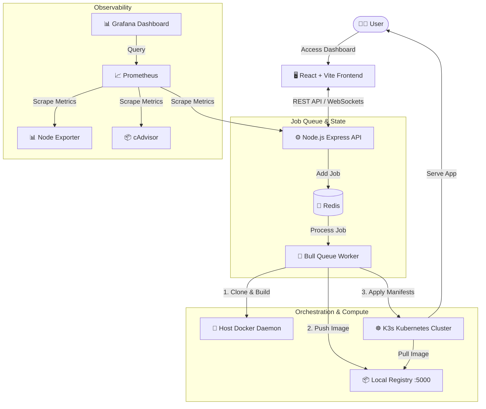
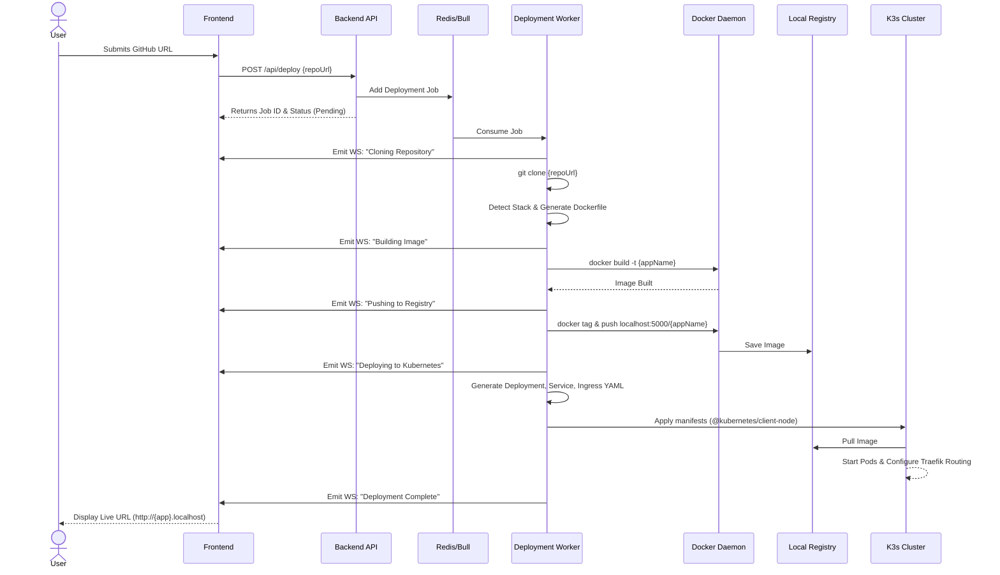

<div align="center">
  
  <h1>🚀 WebLaunch</h1>
  <p><strong>The Fully Automated, Zero-Config Website Deployment & Orchestration Platform</strong></p>
  
  [](https://opensource.org/licenses/MIT)
  [](https://reactjs.org/)
  [](https://nodejs.org/)
  [](https://kubernetes.io/)
  [](https://www.docker.com/)
  [](https://grafana.com/)

</div>

---

## 📖 Table of Contents
1. [Introduction & Problem Statement](#-introduction--problem-statement)
2. [High-Level Architecture](#-high-level-architecture)
3. [The Deployment Lifecycle (Sequence Flow)](#-the-deployment-lifecycle-sequence-flow)
4. [Theoretical Foundation & Engineering Principles](#-theoretical-foundation--engineering-principles)
5. [Deep Dive: Technology Stack Analysis](#-deep-dive-technology-stack-analysis)
    * [Frontend Presentation Layer](#1-frontend-presentation-layer)
    * [Backend Orchestration API](#2-backend-orchestration-api)
    * [Asynchronous Task Queue](#3-asynchronous-task-queue--state-management)
    * [Containerization & Kubernetes (K3s)](#4-containerization--kubernetes-k3s-orchestration)
    * [Observability & Telemetry](#5-observability--telemetry-stack)
6. [Security Architecture](#-security-architecture)
7. [Directory Structure](#-directory-structure)
8. [Comprehensive Setup & Installation Guide](#-comprehensive-setup--installation-guide)
9. [Detailed Usage & Workflows](#-detailed-usage--workflows)
10. [Troubleshooting Guide](#-troubleshooting-guide)
11. [Roadmap & Future Enhancements](#-roadmap--future-enhancements)
12. [License & Acknowledgements](#-license--acknowledgements)

---

## 🌟 Introduction & Problem Statement

### The Problem
Modern web deployment is overly complex. Developers wanting to quickly host a full-stack application, a React frontend, or a simple Node.js server are forced to navigate a labyrinth of tools: configuring Dockerfiles, setting up cloud infrastructure (AWS/GCP), managing Kubernetes manifests, dealing with CI/CD pipelines, configuring Ingress controllers, and setting up monitoring. This creates a massive barrier to entry and slows down the feedback loop for developers who just want to see their code live.

### The Solution: WebLaunch
**WebLaunch** is a monolithic-in-deployment, microservices-in-architecture platform designed to act as your personal Platform as a Service (PaaS). It abstracts away the entire infrastructure layer. You provide a public GitHub URL, and WebLaunch handles the rest: 
1. Source code cloning
2. Stack detection (Node, React, Static, etc.)
3. Dynamic Docker image building
4. Local Registry push
5. Kubernetes manifest generation (Deployments, Services, Ingress)
6. Live application routing via local domains

All of this happens locally, orchestrated by a single, powerful `docker-compose.yml` file, giving you a production-grade Kubernetes environment right on your laptop without the overhead of Minikube or external cloud costs.

---

## 🏛️ High-Level Architecture

WebLaunch uses a modular microservices architecture, entirely containerized.



---

## 🔄 The Deployment Lifecycle (Sequence Flow)

Understanding how a repository turns into a live URL is critical. Here is the step-by-step sequence of the WebLaunch engine:



---

## 🧠 Theoretical Foundation & Engineering Principles

WebLaunch is built upon several core software engineering and DevOps principles:

1. **Infrastructure as Code (IaC) & Configuration as Data**: 
   The entire platform is defined in a single `docker-compose.yml`. This ensures idempotency; the environment is identical regardless of the host machine. Kubernetes manifests are dynamically generated as JavaScript objects (JSON/YAML) and applied programmatically, eliminating manual `kubectl` errors.

2. **Event-Driven Architecture (EDA)**:
   The user interface is entirely reactive. Long-polling is avoided in favor of WebSockets. When the backend worker shifts states (e.g., from `Building` to `Deploying`), it emits real-time events. This decouples the client from the server's processing limitations.

3. **Asynchronous Non-Blocking Processing**:
   Node.js is single-threaded. Building a Docker image can freeze the event loop. WebLaunch offloads these intensive tasks to a separate worker process managed by Bull and Redis, ensuring the main API remains highly available for incoming requests.

4. **Container Orchestration vs. Containerization**:
   While Docker containerizes the application, K3s (Kubernetes) orchestrates it. K3s handles the declarative state—if a user's deployed pod crashes, K3s automatically restarts it based on the `ReplicaSet` configuration. It also provides built-in load balancing (Traefik Ingress).

---

## 🔍 Deep Dive: Technology Stack Analysis

This section explores the technologies used in WebLaunch, detailing both *why* they were chosen (theoretical) and *how* they are implemented (practical).

### 1. Frontend Presentation Layer
**Technologies:** React 18, Vite, Tailwind CSS, Lucide React, Recharts, Socket.IO Client.

*   **Theoretical Perspective:**
    React's virtual DOM reconciliation algorithm allows for highly efficient updates, which is crucial when streaming hundreds of lines of build logs per second. Vite replaces traditional bundlers like Webpack by leveraging native ES modules in the browser, offering sub-second Hot Module Replacement (HMR). Tailwind CSS shifts styling from separate CSS files to utility classes directly in the markup, reducing context switching and enforcing a strict design system.
*   **Practical Implementation:**
    *   **Architecture:** The frontend is organized by `pages/` (Dashboard, Settings, CodeQuality) and `components/` (Cards, Modals, Terminal).
    *   **State Management:** React Context and standard hooks (`useState`, `useEffect`) manage local state, while `@tanstack/react-query` handles caching and synchronization of server data (fetching deployment lists).
    *   **Real-time Logs:** The `Socket.IO` client connects to the backend namespace. It listens for `log` and `status-update` events, appending them to a custom "Terminal" component that auto-scrolls, providing a Vercel-like build experience.

### 2. Backend Orchestration API
**Technologies:** Node.js (v18+), Express, Dockerode, @kubernetes/client-node, simple-git.

*   **Theoretical Perspective:**
    Node.js's non-blocking I/O is perfectly suited for an orchestrator that spends most of its time waiting for other systems (Docker daemon, Kubernetes API, GitHub). `Dockerode` is a pure JavaScript client for the Docker Remote API, eliminating the need to execute shell scripts. The Kubernetes client allows programmatic, type-safe interaction with the K8s API server.
*   **Practical Implementation:**
    *   **Git Operations:** Uses `simple-git` to clone repositories into a temporary workspace (`/tmp/deployments`).
    *   **Stack Detection:** The backend analyzes the `package.json` (for Node/React apps) or `index.html` (for static sites) to determine the build context.
    *   **Dockerode:** It creates a tarball of the workspace and streams it via Unix socket (`/var/run/docker.sock`) to the Docker daemon to build the image. It streams the `stdout` back to the client via WebSockets.
    *   **K8s Manifest Generation:** Uses JavaScript objects to construct K8s `Deployment`, `Service`, and `Ingress` YAML definitions dynamically, injecting the correct image names and port mappings, then applies them using `k8sApi.replaceNamespacedDeployment` or `createNamespacedDeployment`.

### 3. Asynchronous Task Queue & State Management
**Technologies:** Redis, Bull.

*   **Theoretical Perspective:**
    A message broker is essential for distributed systems. Redis is an in-memory data store providing sub-millisecond read/write speeds. Bull is a Node.js library that implements a robust queue system on top of Redis, providing job persistence, retries, concurrency control, and delayed execution.
*   **Practical Implementation:**
    When a user clicks "Deploy", the Express route handler immediately responds with `202 Accepted` and a Job ID. Under the hood, it pushes the data ` { repoUrl, branch }` to a Bull queue named `deployments`. A separate worker file (`deploymentWorker.js`) processes jobs from this queue one at a time. Redis also acts as the pub/sub backplane for Socket.IO, allowing real-time event broadcasting across multiple instances if the backend were to scale.

### 4. Containerization & Kubernetes (K3s) Orchestration
**Technologies:** Docker, K3s (Rancher), Local Docker Registry.

*   **Theoretical Perspective:**
    Kubernetes is traditionally heavy, requiring significant RAM and CPU just for the control plane. K3s strips out legacy, alpha, and non-default features, substituting etcd with SQLite, resulting in a single binary under 100MB. It's the perfect Kubernetes distribution for local development and CI pipelines.
*   **Practical Implementation:**
    *   **K3s in Docker (K3d paradigm):** The `docker-compose.yml` runs the `rancher/k3s` image in privileged mode. It exposes the Kubeconfig file to a shared volume so the Node.js backend can authenticate.
    *   **The Registry Bridge:** Kubernetes cannot directly pull images from the host's local Docker cache. Therefore, a `registry:2` container runs on port 5000. The backend builds the image, tags it as `localhost:5000/app-name`, and pushes it. K3s is configured via `/etc/rancher/k3s/registries.yaml` to trust this insecure local registry and pull images from it.
    *   **Routing:** K3s comes bundled with Traefik. The backend generates an Ingress route for `Host(\`app-name.localhost\`)`, routing host traffic on port 80 directly to the pod.

### 5. Observability & Telemetry Stack
**Technologies:** Prometheus, Grafana, Node Exporter, cAdvisor.

*   **Theoretical Perspective:**
    You cannot manage what you cannot measure. Observability comprises Metrics, Logs, and Traces. Prometheus handles metrics via a pull-based model (scraping `/metrics` endpoints). Grafana provides the visualization layer.
*   **Practical Implementation:**
    *   **Node Exporter:** Runs as a container with host filesystem mounts (`/proc`, `/sys`) to report host CPU, RAM, and Disk I/O.
    *   **cAdvisor:** Interacts with the Docker daemon to report resource usage for *every running container*, including the K3s pods.
    *   **Prometheus:** Scrapes these targets every 15 seconds.
    *   **Grafana:** Pre-provisioned via volumes with data sources (Prometheus) and dashboards (`platform.json`, `deployments.json`). Users can instantly see the CPU usage of their dynamically deployed GitHub repositories.

---

## 🛡️ Security Architecture

While designed for local development, WebLaunch incorporates several security best practices:
*   **Principle of Least Privilege:** The Node.js backend does not run as root. It only has access to the specific volumes required (logs, temporary deployment directories).
*   **Namespace Isolation:** All user applications are deployed into a specific Kubernetes namespace (e.g., `weblaunch-apps`), isolating them from the `kube-system` resources.
*   **Secret Management:** Environment variables (like database passwords or API keys) are managed via `.env` files and not hardcoded.
*   **Helmet.js:** The Express backend uses Helmet to set secure HTTP headers (XSS protection, preventing clickjacking).
*   **Rate Limiting:** `express-rate-limit` prevents abuse of the deployment endpoints.

---

## 📁 Directory Structure

```text
WebLaunch/
├── docker-compose.yml       # The master orchestrator for the platform
├── .env                     # Environment variables configuration
├── .gitignore               # Git ignore rules
├── README.md                # This comprehensive documentation
│
├── frontend/                # React Vite Frontend Application
│   ├── Dockerfile           # Frontend container definition
│   ├── package.json         # Node dependencies
│   ├── tailwind.config.js   # Tailwind CSS configuration
│   ├── vite.config.js       # Vite bundler configuration
│   └── src/
│       ├── App.jsx          # Main application component & routing
│       ├── main.jsx         # React entry point
│       ├── components/      # Reusable UI components (Cards, Layout)
│       ├── pages/           # Route pages (Dashboard)
│       └── utils/           # Helper functions
│
├── backend/                 # Node.js Express Backend API
│   ├── Dockerfile           # Backend container definition
│   ├── package.json         # Node dependencies
│   └── src/
│       ├── index.js         # Entry point, Express setup, Socket.IO init
│       ├── routes/          # API endpoint controllers (deploy.js)
│       ├── services/        # Core business logic
│       │   ├── dockerBuilder.js # Dockerode interaction logic
│       │   ├── k8sClient.js     # Kubernetes API interaction
│       │   └── deploymentWorker.js # Bull queue processor
│       └── utils/           # Helper functions (logger, file system)
│
└── monitoring/              # Observability Configuration
    ├── prometheus/
    │   └── prometheus.yml   # Prometheus scraping targets
    └── grafana/
        ├── provisioning/    # Auto-setup data sources
        └── dashboards/      # Pre-built JSON dashboards
```

---

## 🚀 Comprehensive Setup & Installation Guide

WebLaunch is engineered to be a "Zero-Config" environment. You do not need to install Node.js, Kubernetes, or Redis on your host machine. Everything runs through Docker.

### Prerequisites
1.  **OS:** Windows 10/11 (with WSL2), macOS, or Linux.
2.  **Docker:** Docker Desktop or Docker Engine installed and running.
3.  **Ports:** Ensure the following ports are NOT in use on your host machine:
    *   `80` / `443` (Traefik Ingress / User Apps)
    *   `3002` (Frontend Dashboard)
    *   `4000` (Backend API)
    *   `5000` (Local Registry)
    *   `6379` (Redis)
    *   `6443` (K3s Kubernetes API)
    *   `3001` (Grafana)
    *   `9090` (Prometheus)

### Installation Steps

1.  **Clone the Repository:**
    Open your terminal and clone the repository to your local machine.
    ```bash
    git clone https://github.com/ShivamKadam63s/WebLaunch.git
    cd WebLaunch
    ```

2.  **Environment Variables (Optional):**
    The system is configured to work out-of-the-box using default values in `docker-compose.yml`. You may create an `.env` file in the root directory to override specific ports or database passwords if needed.

3.  **Start the Platform:**
    Execute the following command in the root directory. This will pull all necessary base images, build the WebLaunch frontend and backend, and start the entire orchestration, queueing, and monitoring stack.
    ```bash
    docker-compose up --build -d
    ```
    *(Note: The initial build may take 3-5 minutes as it downloads K3s, Redis, Prometheus, Grafana, and compiles the React application).*

4.  **Verify the System:**
    Check that all containers are running successfully:
    ```bash
    docker-compose ps
    ```
    You should see containers for `frontend`, `backend`, `k3s`, `registry`, `redis`, `prometheus`, `grafana`, `node-exporter`, and `cadvisor` in the `Up` state.

---

## 💻 Detailed Usage & Workflows

Once the system is running, you can access the various interfaces and begin deploying applications.

### 1. Accessing the Platform Hubs
Open your web browser and navigate to:
*   **🎛️ WebLaunch Dashboard (Frontend):** `http://localhost:3002`
*   **📊 Grafana Monitoring:** `http://localhost:3001` *(No login required, anonymous access enabled)*
*   **📈 Prometheus Metrics:** `http://localhost:9090`

### 2. Deploying Your First Application
1.  Go to the Frontend Dashboard (`http://localhost:3002`).
2.  In the deployment input field, paste the URL of a public GitHub repository. 
    *Example: `https://github.com/bradtraversy/design-resources-for-developers` (Static HTML) or a Node.js Express app.*
3.  Click **Deploy**.
4.  **Watch the Magic:** The real-time terminal will appear. You will see the system:
    *   Initialize the job in the Redis queue.
    *   Clone the repository locally.
    *   Detect the framework and generate a Dockerfile.
    *   Stream the `docker build` logs.
    *   Push to the local registry.
    *   Generate and apply Kubernetes manifests.
5.  **Access Your App:** Once deployment is complete, the dashboard will provide a clickable URL, formatted as `http://{repo-name}.localhost`. Click it to view your live, orchestrated application!

### 3. Monitoring the Infrastructure
1.  Navigate to Grafana (`http://localhost:3001`).
2.  Open the **WebLaunch Platform** dashboard.
3.  Here you can monitor the real-time resource consumption (CPU, Memory, Network TX/RX) of the underlying K3s cluster, the Redis queue length, and the performance of your dynamically deployed user applications.

---

## 🛠️ Troubleshooting Guide

If you encounter issues, here are common solutions:

*   **Error: "Port is already allocated"**
    *   *Cause:* Another service on your machine (like local Postgres, Apache, or another Docker container) is using a required port (e.g., 80, 5000).
    *   *Solution:* Stop the conflicting service, or modify the port mapping in `docker-compose.yml`.
*   **Error: K3s fails to start / Kubernetes API unreachable**
    *   *Cause:* Docker may not have enough resources allocated, or there's a conflict with the Docker socket volume mount.
    *   *Solution:* Ensure Docker Desktop is allocated at least 4GB of RAM and 2 CPUs. Restart Docker daemon.
*   **Deployment gets stuck on "Building Image"**
    *   *Cause:* The generated Dockerfile might be failing to build due to missing dependencies in the user's repository (e.g., `npm install` failing).
    *   *Solution:* Check the real-time terminal logs in the UI. You can also view backend logs directly via `docker-compose logs -f backend`.
*   **Cannot access `http://appname.localhost`**
    *   *Cause:* Your browser or OS might not resolve `.localhost` domains to `127.0.0.1` automatically.
    *   *Solution:* Most modern browsers (Chrome, Edge) support this natively. If using Firefox, you may need to adjust `network.dns.localDomains`. Alternatively, add an entry to your OS `hosts` file: `127.0.0.1 appname.localhost`.

---

## 🗺️ Roadmap & Future Enhancements

WebLaunch is continuously evolving. Planned features include:

*   **[ ] Private Repository Support:** Integration with GitHub OAuth to allow users to deploy private repositories securely.
*   **[ ] Advanced Stack Detection:** Support for Python (Django/Flask), Go, and Rust applications.
*   **[ ] Custom Domain Mapping:** Allow users to map custom domains (e.g., `myapp.com`) instead of just `.localhost` routing.
*   **[ ] Persistent Storage:** Automatically provision Persistent Volume Claims (PVCs) for applications that require databases (e.g., WordPress).
*   **[ ] Distributed Architecture:** Refactor the deployment worker to run as a scalable Kubernetes deployment rather than a standalone Docker container.
*   **[ ] Environment Variable Management:** Add a UI to securely inject custom environment variables into deployed pods.

---

## 📄 License & Acknowledgements

This project is licensed under the **MIT License** - see the [LICENSE](LICENSE) file for details.

Developed with ❤️ as a comprehensive exploration of DevOps, Container Orchestration, and Automated CI/CD pipelines.

---
*End of Documentation. WebLaunch - Automating the web, one container at a time.*
