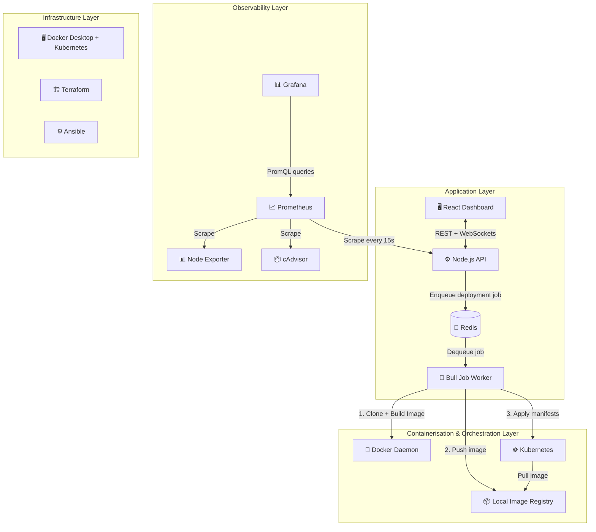
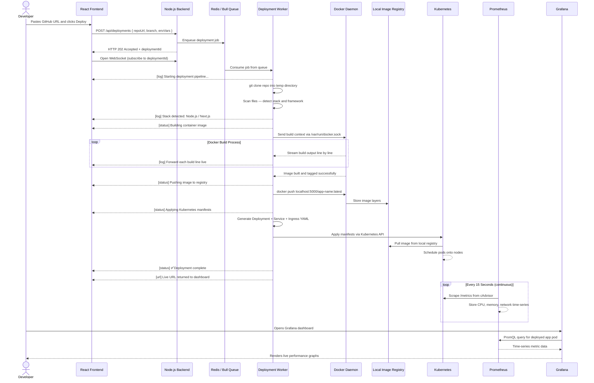

<div align="center">

# 🚀 WebLaunch Platform

**The Fully Automated, Zero-Config Website Deployment & Orchestration Platform**

[](https://opensource.org/licenses/MIT)
[](https://reactjs.org/)
[](https://nodejs.org/)
[](https://kubernetes.io/)
[](https://www.docker.com/)
[](https://grafana.com/)
[](https://prometheus.io/)
[](https://www.terraform.io/)
[](https://www.ansible.com/)

</div>

---

## What is WebLaunch?

WebLaunch is a self-hosted deployment platform — similar in spirit to Vercel or Heroku, but fully open-source and running entirely on your own machine. You paste a public GitHub repository URL into the dashboard. WebLaunch takes it from there: it clones the code, figures out the technology stack, writes a Dockerfile, builds a container image, deploys it to Kubernetes, and automatically begins monitoring it — all without you writing a single line of configuration.

The entire platform is orchestrated through a single `docker-compose.yml` and runs on Docker Desktop. Every service — frontend, backend, queue, monitoring — spins up together with one command.

---

## High-Level Architecture

The platform is built across four distinct layers. Each layer has a clear responsibility and communicates with the others in a defined way.



---

## Deployment Lifecycle — Full Sequence Flow

This diagram shows exactly what happens, step by step, from the moment a user submits a GitHub URL to the moment their app is live and being monitored.



---

## How the Major Components Work

### 🖥️ Frontend — React Dashboard

The frontend is built with React 18, Vite, and Tailwind CSS. It serves as the control panel for the entire platform.

- **Vite** compiles and serves the React app with near-instant hot reload during development. In production it is built into static files served by Nginx inside a Docker container.
- **React Query** manages all API data fetching — it polls deployment status every 5 seconds automatically and keeps the UI in sync without manual refresh.
- **Socket.IO client** maintains a persistent WebSocket connection to the backend. When a deployment is running, the backend pushes log lines through this connection in real time, and the `LogViewer` component renders them line by line — like a live terminal in your browser.
- **Recharts** powers the monitoring page, rendering CPU, memory, and request graphs from metric data returned by the backend.

Key pages: `Dashboard` (all deployments), `Deploy` (new deployment form), `DeploymentDetail` (live logs + metadata), `Monitoring` (metrics charts + Grafana links).

---

### ⚙️ Backend — Node.js Orchestration Engine

The backend is an Express server that acts as the brain of the platform. It does not do heavy lifting itself — it delegates work to the queue and communicates with Docker and Kubernetes.

- **`repoAnalyzer.js`** — Clones the GitHub repository into a temp directory using `simple-git`, then scans the file tree. It checks for `package.json`, `requirements.txt`, `go.mod`, `Cargo.toml`, `pom.xml`, and others to identify the stack. It returns the detected framework along with the right build command, start command, and port.

- **`dockerBuilder.js`** — Takes the detected stack info and generates an optimised, multi-stage Dockerfile tailored for that stack. It then communicates with the Docker daemon directly via the Unix socket (`/var/run/docker.sock`) using the `dockerode` library — no shell commands, no `exec('docker build')`. It streams the build output event-by-event back to the worker, which forwards it to the browser via WebSocket.

- **`k8sManager.js`** — Once the image is built and pushed to the local registry, this service uses the official `@kubernetes/client-node` library to programmatically create a `Deployment`, `Service`, and optional `Ingress` object inside the Kubernetes cluster. It talks directly to the Kubernetes API server.

- **`deploymentStore.js`** — All deployment state (status, logs, metadata) is stored in Redis as key-value pairs. This means the deployment history survives backend restarts.

- **Socket.IO server** — Manages WebSocket rooms, one per deployment ID. Any log or status update gets emitted to the matching room, so only the browser tab watching that deployment receives its logs.

---

### 💾 Redis + Bull — Async Job Queue

Building Docker images and deploying to Kubernetes takes time — sometimes 30 to 90 seconds. Doing this synchronously inside an HTTP request would cause timeouts and block other requests.

Instead, when a deployment is requested, the backend immediately enqueues a job in **Bull** (a Redis-backed job queue) and returns a `202 Accepted` response. The worker picks up the job asynchronously and processes it independently.

This design means:
- The API stays responsive at all times
- If the backend crashes mid-deployment, the job remains safely in Redis and resumes when the service comes back up
- Multiple deployments can run concurrently (concurrency is set to 2 by default)

Redis also acts as the Socket.IO pub/sub adapter, which is important if the backend ever scales to multiple instances — a WebSocket message from Worker A will correctly reach a browser connected to API Node B.

---

### 🐳 Docker — Containerisation

Docker is the foundation everything else builds on. Every service in WebLaunch runs as a Docker container — the frontend, backend, Redis, Prometheus, Grafana, and the apps being deployed.

When a user's app is deployed:
1. The backend communicates with the Docker daemon through the mounted socket (`/var/run/docker.sock`)
2. A Dockerfile is generated based on the detected stack (Node.js gets a multi-stage Alpine build, Python gets a slim image with pip install, Go gets a distroless binary, etc.)
3. The image is built and tagged, then pushed to a local Docker registry running as a container on port `5000`
4. Kubernetes pulls the image from this local registry to run the user's app as a pod

The full platform itself is defined in `docker-compose.yml` — 7 containers, two custom networks (`weblaunch-net` and `monitoring-net`), and named volumes for persistent data.

---

### ☸️ Kubernetes — Orchestration

Kubernetes manages the lifecycle of deployed user applications. WebLaunch uses the Kubernetes cluster that ships built-in with Docker Desktop.

When a deployment completes the build phase, WebLaunch's backend generates and applies three Kubernetes resources:

- **Deployment** — defines the container image to run, how many replicas, resource limits (CPU/memory), health check probes (liveness and readiness), and environment variables.
- **Service** — exposes the deployment internally within the cluster on port 80, routing traffic to the container's actual port.
- **HorizontalPodAutoscaler (HPA)** — automatically scales the number of pod replicas up or down based on CPU and memory usage thresholds.

The `k8s/base/` directory also contains pre-written manifests for the WebLaunch platform itself (backend, frontend, Redis) so it can be deployed onto any Kubernetes cluster directly using `kubectl apply`.

---

### 📈 Prometheus — Metrics Collection

Prometheus is a time-series database built for monitoring. It works on a **pull model** — instead of apps pushing data to it, Prometheus scrapes HTTP endpoints on a schedule (every 15 seconds by default).

WebLaunch configures Prometheus to scrape three targets:

- **`/metrics` on the backend** — the backend uses `prom-client` to expose Node.js runtime metrics (event loop lag, heap usage, HTTP request counts and durations) in Prometheus format.
- **Node Exporter** — a lightweight agent that exposes host-level metrics: CPU usage per core, RAM, disk I/O, network bandwidth.
- **cAdvisor** — a Google-built container metrics exporter. It reads directly from the Docker daemon and exposes per-container CPU, memory, and network stats. This is how Prometheus knows exactly how much CPU a specific user's deployment pod is consuming.

Alert rules are pre-configured in `monitoring/prometheus/rules/alerts.yml` and fire when the backend goes down, CPU exceeds 85%, or memory exceeds 90%.

---

### 📊 Grafana — Metrics Visualisation

Grafana turns raw Prometheus data into dashboards. On startup, Grafana automatically reads provisioning files that configure two things without any manual setup:

- **Datasource** — connects Grafana to the Prometheus container on the internal Docker network
- **Dashboard** — loads `weblaunch.json`, a pre-built dashboard with panels for CPU over time, memory over time, container-level resource usage, and backend health status

The dashboard refreshes every 10 seconds and shows data for all running containers, including any apps users have deployed. Opening http://localhost:3001 after starting the platform gives an instant, fully populated view of the system.

---

### 🏗️ Terraform — Infrastructure Provisioning

Terraform defines cloud infrastructure as code. The `terraform/` directory contains modules for provisioning a VPC, an EKS (Kubernetes) cluster, ECR image registries, and a full monitoring stack via Helm — all declaratively. Running `terraform apply` provisions the entire cloud environment reproducibly. It also uses the Helm provider to bootstrap Prometheus and Grafana directly into the EKS cluster during provisioning.

---

### ⚙️ Ansible — Server Configuration

Ansible automates the configuration of Linux servers over SSH. The `ansible/` directory contains roles for installing Docker, configuring kernel parameters, installing Kubernetes tooling (`kubeadm`, `kubelet`, `kubectl`), and deploying the WebLaunch stack. The `site.yml` playbook runs all roles in order. The `deploy-app.yml` playbook handles rolling deployments — updating one server at a time and verifying health before moving to the next.

---

## Prerequisites

- [Docker Desktop](https://www.docker.com/products/docker-desktop/) with **Kubernetes enabled**
  - Docker Desktop → Settings → Kubernetes → ✅ Enable Kubernetes
- Git

---

## Running the Platform

```bash
# 1. Clone the repository
git clone https://github.com/yourname/WebLaunch.git
cd WebLaunch

# 2. Set up environment
cp .env.example .env

# 3. Start the full platform
docker compose up -d --build

# 4. Check all containers are healthy
docker compose ps
```

| Service | URL | Credentials |
|---|---|---|
| WebLaunch Dashboard | http://localhost:3000 | — |
| Grafana | http://localhost:3001 | `admin / admin123` |
| Prometheus | http://localhost:9090 | — |
| Backend API | http://localhost:4000/health | — |

```bash
# Stop everything
docker compose down

# Stop and wipe all data volumes
docker compose down -v
```

---

## Directory Structure

```text
WebLaunch/
├── docker-compose.yml                  # Entire platform in one file
├── .env.example                        # Environment variable template
├── .gitignore
├── README.md
│
├── backend/                            # Node.js orchestration engine
│   ├── Dockerfile
│   ├── package.json
│   └── src/
│       ├── index.js                    # Express + Socket.IO entry point
│       ├── routes/
│       │   ├── deploy.js               # POST /api/deployments
│       │   ├── status.js               # GET  /api/status/:id
│       │   └── logs.js                 # GET  /api/logs/:id
│       ├── services/
│       │   ├── repoAnalyzer.js         # Clone repo + detect stack
│       │   ├── dockerBuilder.js        # Generate Dockerfile + build image
│       │   ├── k8sManager.js           # Create K8s Deployment / Service
│       │   ├── deploymentQueue.js      # Bull queue setup
│       │   ├── deploymentWorker.js     # Queue job processor
│       │   ├── deploymentStore.js      # Redis state store
│       │   └── redisClient.js
│       ├── middleware/
│       │   ├── errorHandler.js
│       │   └── auth.js
│       └── utils/
│           └── logger.js
│
├── frontend/                           # React + Vite dashboard
│   ├── Dockerfile
│   ├── nginx.conf
│   ├── index.html
│   ├── vite.config.js
│   ├── tailwind.config.js
│   └── src/
│       ├── App.jsx
│       ├── main.jsx
│       ├── index.css
│       ├── pages/
│       │   ├── Dashboard.jsx
│       │   ├── Deploy.jsx
│       │   ├── DeploymentDetail.jsx
│       │   └── Monitoring.jsx
│       ├── components/
│       │   ├── common/
│       │   │   ├── Layout.jsx
│       │   │   ├── StatusBadge.jsx
│       │   │   ├── StackIcon.jsx
│       │   │   └── LoadingSpinner.jsx
│       │   ├── deploy/
│       │   │   ├── DeployForm.jsx
│       │   │   └── LogViewer.jsx
│       │   └── monitoring/
│       │       └── MetricsChart.jsx
│       ├── hooks/
│       │   └── useDeployments.js
│       └── utils/
│           ├── api.js
│           └── socket.js
│
├── k8s/                                # Kubernetes manifests
│   └── base/
│       ├── namespace.yml
│       ├── backend-deployment.yml
│       ├── frontend-deployment.yml
│       ├── redis.yml
│       ├── ingress.yml
│       └── hpa.yml
│
├── terraform/                          # Cloud infrastructure as code
│   ├── main.tf
│   ├── variables.tf
│   ├── outputs.tf
│   └── modules/
│       ├── vpc/
│       ├── eks/
│       ├── ecr/
│       └── monitoring/
│
├── ansible/                            # Server configuration management
│   ├── ansible.cfg
│   ├── inventory/
│   │   ├── hosts.yml
│   │   └── group_vars/all.yml
│   ├── playbooks/
│   │   ├── site.yml
│   │   └── deploy-app.yml
│   └── roles/
│       ├── common/
│       ├── docker/
│       ├── kubernetes/
│       └── monitoring/
│
├── monitoring/
│   ├── prometheus/
│   │   ├── prometheus.yml              # Scrape targets config
│   │   └── rules/alerts.yml            # Alerting rules
│   └── grafana/
│       ├── dashboards/
│       │   └── weblaunch.json          # Pre-built dashboard
│       └── provisioning/
│           ├── datasources/
│           └── dashboards/
│
└── scripts/
    ├── setup.sh
    ├── deploy-k8s.sh
    └── terraform-apply.sh
```

---

## License

MIT © WebLaunch Contributors
